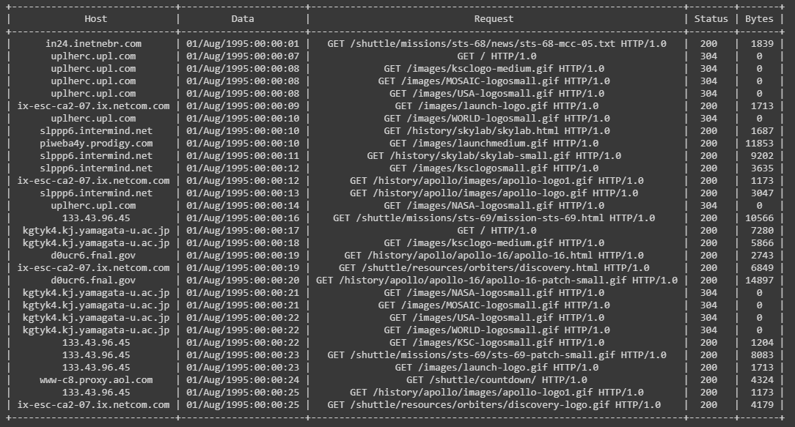

# Nasa-Logs
Repositório de arquivos utilizados no Python Bootcamp da pós graduação

Dados dois conjuntos de dados que possuem todas as requisições HTTP para o servidor da NASA Kennedy Space Center WWW na
Flórida para um período específico, você fará uma análise de dados a seguir.

Os conjuntos de dados representam logs que estão em arquivos ASCII com uma linha por requisição com as seguintes colunas:

Host fazendo a requisição. Um hostname quando possível, caso contrário o endereço de
internet se o nome não puder ser identificado.
Timestamp no formato "DIA/MÊS/ANO:HH:MM:SS TIMEZONE"
Requisição (entre aspas)
Código do retorno HTTP
Total de bytes retornados

Use Python com PySpark para descobrir as seguintes informações:

 Número de hosts únicos.
 O total de erros 404.
 Os 5 URLs que mais causaram erro 404.
 Quantidade de erros 404 por dia.
 O total de bytes retornados.

